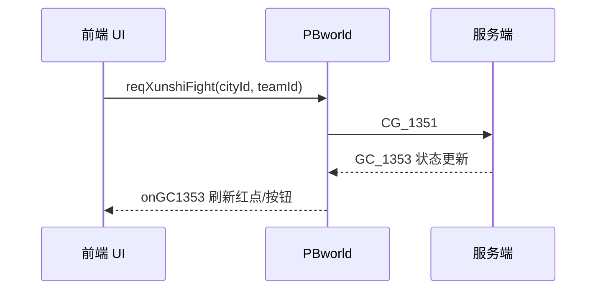

# <功能名> 逻辑需求文档

> 生成时间：YYYY-MM-DD  
> 策划来源：`<docx 相对路径>`  
> 涉及协议：`<PBxxx.ts>` / `<xxx.proto>`（无则删本节）

---

## 1. 功能概述

（从策划 docx 提炼：玩家目标、入口、核心循环、边界条件）

---

## 2. 前后端职责划分

| 模块/行为 | 负责方 | 说明 |
| :--- | :--- | :--- |
| 例：巡视资格判定（赛季、通关前置） | **后端** | 服务端校验，前端仅展示结果 |
| 例：可巡视城池列表 UI 筛选 | **前端** | 读表 + 本地状态过滤 |
| 例：发起巡视战斗 | **前后端** | 前端发 CG，后端战斗结算并推 GC |

**原则**：状态以服务端为准；前端读表负责展示、预判断、红点；纯表现与动画归前端。

---

## 3. 配置表

### 3.1 涉及表清单

| 表名常量 | 中文名 | 类型定义 | 用途摘要 |
| :--- | :--- | :--- | :--- |
| `tbp.fn.shijiexunshi_` | 世界巡视 | `tbp_shijiexunshi` | 城池巡视配置 |

### 3.2 字段说明（逐表）

#### 表：`shijiexunshi_`

（按 tb-field-parsing.md 格式逐字段列出）

---

## 4. 前后端交互（可选）

> 用户未指定 PB/proto 时写「待补充协议」并列出 docx 中隐含的网络行为。

### 4.1 协议总览

| 方向 | 协议号 | Message | 触发时机 | 前端入口 |
| :--- | :--- | :--- | :--- | :--- |
| C→S | 1351 | `CG_1351` | 发起巡视战斗 | `PBworld.reqXunshiFight` |
| S→C | 1350 | `GC_1350` | 登录/进图同步 | `PBworld.NDGC_1350` → `WorldMapProtocolListener.onGC1350` |

### 4.2 协议时序



### 4.3 字段与状态枚举

（从 .proto 注释整理 map key/value、state 含义）

---

## 5. 伪逻辑（前端实现向）

> 每条逻辑标明：读表字段、依赖模块变量/接口、UI 或 ECS 落点。参考用户提供的代码片段对齐命名。

### 5.1 `<函数或流程名>`

```
输入：...
输出：...

伪代码：
  ids = LD.getTB(tbp.fn.shijiexunshi_).aIds
  for cityId in ids:
    cfg = LD.getLine(tbp.fn.shijiexunshi_, cityId)
    if not inSeason(cfg.v_s(tbp.shijiexunshi_.saiji_)): continue
    state = MapData.xunshiData[cityId]  // 来自 GC_1350
    if state == 可领奖: ...
  return result
```

### 5.2 模块依赖

| 依赖 | 路径/符号 | 用途 |
| :--- | :--- | :--- |
| 网络 | `PBworld.i` | 发请求 |
| 数据 | `MapData` / `PBComData.i` | 玩家态 |
| 工具 | `GoodsUtil` | 奖励串解析 |

---

## 6. UI / 场景落点（可选）

| 界面/组件 | 路径 | 职责 |
| :--- | :--- | :--- |
| | | |

---

## 7. 异常与边界

- 表 id 不存在：`LD.getLine` 会 warn，需兜底
- 协议未回包：...
- 功能未开放：`gongneng_` 表（若 docx 提及）

---

## 8. 待确认项

- [ ] 策划 docx 与表字段冲突点
- [ ] 未指定协议的交互
- [ ] 参考代码与 docx 不一致处
